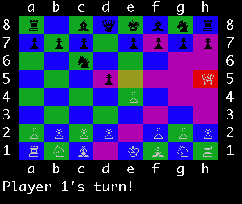

# Chess
[Click here to play!](https://andrewliu.io/asteroids)

## Description
Ruby chess game played in the terminal.

## Instructions
To start a new game, run the game.rb file ('ruby game.rb')

Use the arrow keys to move and enter select and move pieces.  When a piece is selected, it's location will be highlighted red.

Note:  This game has a dependency on the colorize gem.  Colorize can be installed with 'gem install colorize'

## Features
* Graphical terminal UI
* Pink highlighting indicates what squares a selected piece can move to
